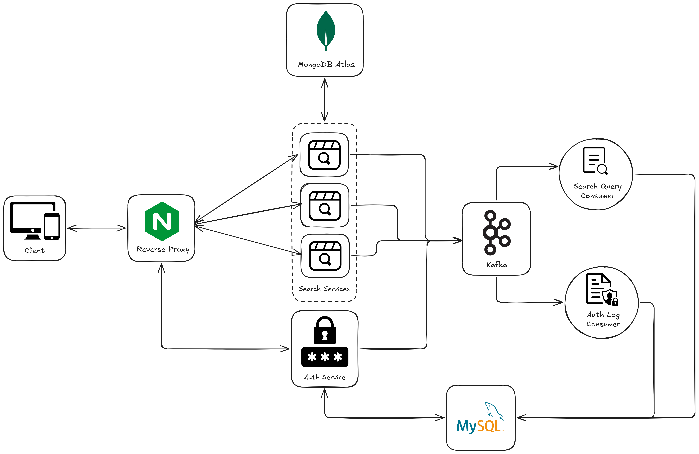

# Movie-Mesh

**Movie-Mesh** is a scalable **microservices-based** movie search platform designed to handle high search traffic, secure authentication, and event-driven processing.
It uses modern backend technologies, asynchronous messaging, and containerization to ensure performance, scalability, and maintainability.

## Features

- Scalable Movie Search with multiple search service instances
- JWT-based Authentication
- Event-Driven Architecture using Kafka
- Centralized Logging & Event Processing
- Cloud-ready Databases (MongoDB Atlas & MySQL)
- Fully Containerized using Docker & Docker Compose

## 🧱 High-Level Architecture



- **Client**: React-based frontend with Bootstrap for responsive UI
- **Nginx**: Reverse proxy and load balancer distributing traffic to backend services
- **Search Service**: Multiple scalable instances handling movie search requests
- **Auth Service**: Manages user authentication with JWT token generation
- **Kafka**: Event streaming platform processing search queries and auth logs
- **MongoDB Atlas**: Cloud database for movie search data (ODM: Mongoose)
- **MySQL**: Relational database for user credentials and logs (ORM: Prisma)
- **Docker**: Containerization for all services orchestrated via Docker Compose

## Tech Stack

<div align="center">

| Category            | Technologies           |
| ------------------- | ---------------------- |
| Frontend            | React, Bootstrap       |
| Proxy/Load Balancer | Nginx                  |
| Backend Services    | Node.js, Kafka         |
| Databases           | MongoDB Atlas, MySQL   |
| ODM                 | Mongoose (MongoDB)     |
| ORM                 | Prisma (MySQL)         |
| Infrastructure      | Docker, Docker Compose |

</div>

## Request Flow

1. Client sends request to **Nginx**
2. Nginx routes:
   - `/search` → Search-Service (load balanced)
   - `/auth` → Auth-Service

3. Services interact with their respective databases
4. Events are produced to **Kafka**
5. Consumers process events asynchronously

## Setup Instructions

### Prerequisites

- Docker & Docker Compose
- _sample_mflix_ dataset in MongoDB Cluster
- MongoDB Atlas Indexes on movies collection (Create using json)

1. **Search Index** - Used for movie searches

```bash
    {
        "mappings": {
            "dynamic": false,
            "fields": {
                "cast": {
                    "analyzer": "lucene.standard",
                    "type": "string"
                },
                "directors": {
                    "analyzer": "lucene.standard",
                    "type": "string"
                },
                "fullplot": {
                    "analyzer": "lucene.english",
                    "type": "string"
                },
                "genres": {
                    "analyzer": "lucene.standard",
                    "type": "string"
                },
                "plot": {
                    "analyzer": "lucene.english",
                    "type": "string"
                },
                "released": {
                    "type": "date"
                },
                "title": {
                    "analyzer": "lucene.standard",
                    "type": "string"
                },
                "writers": {
                    "analyzer": "lucene.standard",
                    "type": "string"
                },
                "year": {
                    "type": "number"
                }
            }
        },
        "storedSource": {
            "include": [
                "title",
                "poster",
                "genres",
                "year",
                "released",
                "imdb",
                "tomatoes"
            ]
        }
    }
```

2. **Autocomplete Index** - Used for movie title suggestions while typing

```bash
    {
        "mappings": {
            "dynamic": false,
            "fields": {
                "title": {
                    "type": "autocomplete",
                    "minGrams": 2,
                    "maxGrams": 15
                }
            }
        },
        "storedSource": {
            "include": ["title", "poster", "year"]
        }
    }
```

### Start Locally

1. Clone the repository

```bash
git clone https://github.com/sanket-164/Movie-Mesh.git
```

2. Navigate to the project directory

```bash
cd Movie-Mesh
```

3. Configure environment variables

- Set up MongoDB Atlas connection strings in docker-compose.yaml

```bash
    environment:
      MONGO_URI: "<mongodb_atlas_connection_string>"
      JWT_SECRET: "jwt_secret_key"
      PORT: "80"
      KAFKA_BROKER: "broker:9092"
```

4. Start all services

```bash
docker-compose up -d
```

<p style="color:red">
NOTE: Steps 5 and 6 are required only on the first Docker Compose run.
</p>

5. Enter Auth Service container

```bash
docker exec -it auth_service sh
```

6. Apply Prisma migration

```bash
npx prisma migrate deploy
```

7. Access the application
   - Client: `http://localhost:4173`
   - API: `http://localhost/api`

8. Stop all services

```bash
docker-compose down
```

## Scalability & Extensibility

- Horizontally scalable Search-Service
- Kafka enables easy addition of new consumers
- Nginx handles load balancing
- Services are loosely coupled

## Future Enhancements

- Search analytics dashboard
- Recommendation engine
- Real-time monitoring with Prometheus & Grafana
- OAuth integration

## Contributing

Contributions are welcome! Please follow these steps.

1. Fork the repository
2. Create your feature branch (`git checkout -b feature/amazing-feature`)
3. Commit your changes (`git commit -m 'Add some amazing feature'`)
4. Push to the branch (`git push origin feature/amazing-feature`)
5. Open a Pull Request

## License

[MIT License](LICENSE)
